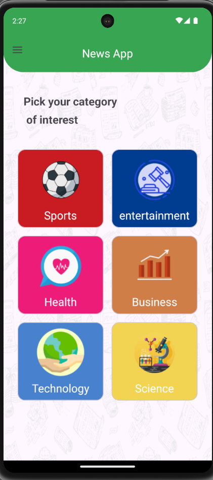
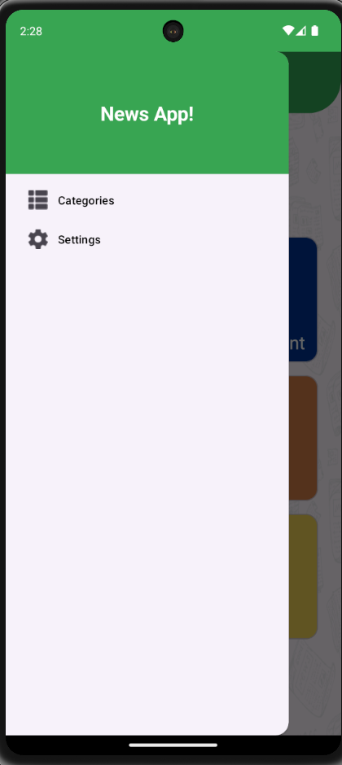
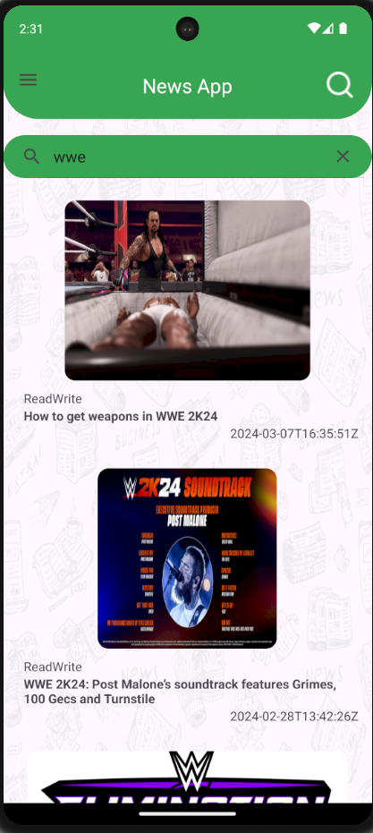

# NewsApp

🔥 The news app is indeed a valuable platform for users to stay informed about current events worldwide. This application offers users the flexibility to select the types of news they wish to see, including categories like sports, technology, business, health, and more. Additionally, users have the capability to search for specific topics or stories they are interested in, enabling them to access relevant information quickly and efficiently. This customizable feature enhances the user experience and ensures that individuals can stay informed about the subjects that matter most to them.

# 💡 Preview

